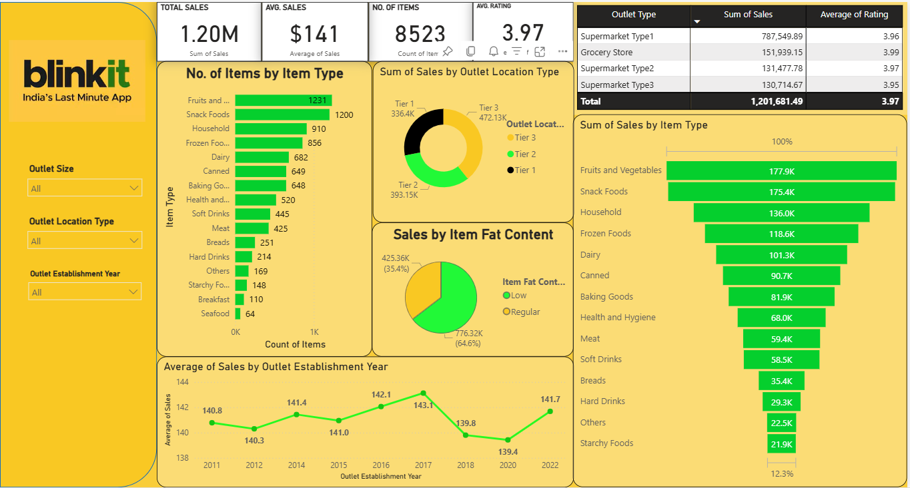

# 🚀 Blinkit Real-Time Dashboard (Power BI + Google Sheets)

A real-time Power BI dashboard project inspired by Blinkit — India’s last-minute delivery app. This dashboard simulates live business insights using dynamic visuals and Google Sheets as a mock real-time data source.

---

## 🔍 Key Highlights of the Dashboard

- ✅ **Live updates** from Google Sheets (mocked real-time data)
- 🎯 **Dynamic visuals** with slicers for day, hour, category, outlet size, and location type
- 📊 **KPI cards** tracking total sales, average sales, number of items, and average ratings
- 🎨 **Custom color palette** to match Blinkit’s brand aesthetics

---

## 🔧 Steps I Followed

1. **Structured sales data** in Google Sheets and enabled a live CSV feed
2. **Connected Power BI** via the Web connector using a public CSV link
3. **Designed visuals** and layout using bar charts, donut charts, tables, and time series
4. **Built DAX measures** for accurate KPIs (like average rating and item counts)
5. **Simulated auto-refresh** to reflect "real-time" behavior from Google Sheets
6. **Exported the final report** and built a public portfolio page for viewing

---

## 📊 Dashboard Features

- **Total Sales & Item Metrics**  
  Real-time KPIs showing total sales, average sale value, item counts, and average product rating

- **Sales Breakdown by Item Type & Fat Content**  
  Explore which types of items perform best and how fat content affects behavior

- **Performance by Outlet Tier (Tier 1/2/3)**  
  Visuals showing revenue contribution by outlet type across different cities

- **Outlet Rating vs Sales**  
  Table + graph showing average ratings versus sales revenue per outlet

- **Sales Trend by Establishment Year**  
  Track which outlet opening years deliver the highest average sales

- **Interactive Filters**  
  Dynamic slicers for outlet size, location type, and more

- **Auto-Refresh Dashboard**
  Data is fetched daily from Google Sheets and transformed using Power BI's ETL pipeline to reflect live insights
  
---

## 🔧 Tech Stack

- **Power BI Desktop** – Data modeling & dashboard design
- **Google Sheets** – Used to simulate real-time live data
- **Power BI Web Connector** – Connected CSV link as a live data feed

---

